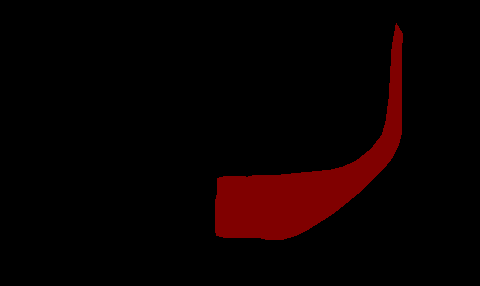

# Ceramics Segmentation Network

Keras implementation of Deep Learning model to extract ceramic profile from input image.  
Segmentation algorithm binarizes input image by assigning each pixel a class label of either 0 (background) or 1 (foreground)
 

# Code
U-Net code taken from [M. Meehan ](https://gist.github.com/margaretmeehan/f6831e5f5b071ba96eabb3dd91f38bec) and
[M. Meehan on Microsoft](https://devblogs.microsoft.com/cse/2018/07/18/semantic-segmentation-small-data-using-keras-azure-deep-learning-virtual-machine/)

## Installing Anaconda environment
cd Ceramics_Segmentation  
conda env create -f environment.yml